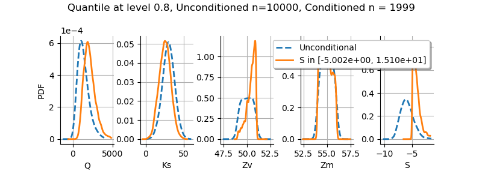

|CI|_ |Python|_ |License|_

.. |CI| image:: https://circleci.com/gh/tupui/otsensitivity.svg?style=svg
.. _CI: https://circleci.com/gh/tupui/otsensitivity

.. |Python| image:: https://img.shields.io/badge/python-2.7,_3.7-blue.svg
.. _Python: https://python.org

.. |License| image:: https://img.shields.io/badge/license-LGPL-blue.svg
.. _License: https://opensource.org/licenses/LGPL

otSensitivity
=============

What is it?
-----------

This project implements Sensitivity Analysis methods.
It is based on `OpenTURNS <http://www.openturns.org>`_.

The simplest analysis is to visualize how the quantity of interest respond
individually to each input parameter:

.. code-block:: python

    pairplot(sample, data)

.. image::  doc/images/ishigami_pairplot.png

This analysis can be completed by quantitative information. Variance-based
analysis is commonly used:

.. code-block:: python

    s, st = sobol_saltelli(function, 1000, 3, [[-np.pi, -np.pi, -np.pi],
                                               [np.pi, np.pi, np.pi]])
    
    plot_indices([s, st])

.. image::  doc/images/ishigami_indices.png

It is possible to use a polar coordinate system: 

.. code-block:: python

    plot_indices([s, st], polar=True)

.. image::  doc/images/ishigami_indices-polar.png

In case of an already existing sample, one can use density based measures:

.. code-block:: python

    momi = moment_independent(X, Y)
    delta = momi[2]['Delta']
    plot_indices([delta])

.. image::  doc/images/ishigami_moment.png

This method use not only the variance but all the PDF in order to compute
sensitivity information. Also, it does not require the use of any particlar
sampling design.

When we are interested in an event associated to a particular
value of the output, we can plot the conditional distributions of the
inputs given the output is in a known interval:

.. code-block:: python

    inputDistribution = ot.KernelSmoothing().build(inputSample)
    grid = plot_event(inputSample, outputSample, indexOutput, lowerValue, upperValue, 
                      inputDistribution)

How to install?
---------------

Requirements
............

The dependencies are: 

- Python >= 2.7 or >= 3.3
- `numpy <http://www.numpy.org>`_ >= 0.10
- `scipy <http://scipy.org>`_ >= 0.15
- `OpenTURNS <http://www.openturns.org>`_ >= 1.12
- `matplotlib <https://matplotlib.org>`_ >= 1.5.3

Installation
............

Using the latest python version is prefered! Then to install::

    git clone git@github.com:.../otsensitivity.git
    cd otsensitivity
    python setup.py install
